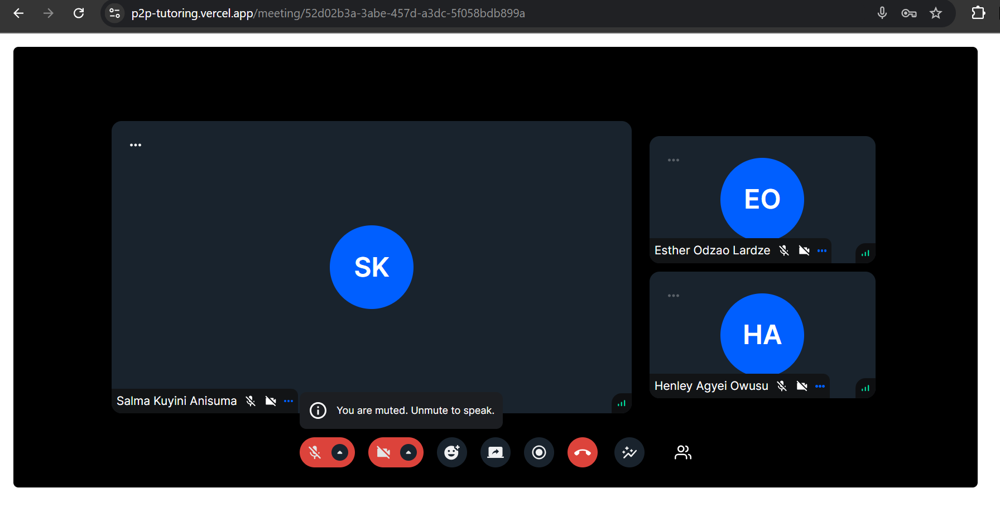

# Peer-to-Peer Tutoring Platform


## Project Overview
This web application aims to alleviate academic challenges faced by students by connecting them with peer tutors within their faculty. The platform facilitates a peer-to-peer tutoring marketplace where students can find Tutors and book them for turorials.


## Target Users
- **Students seeking academic assistance**: Those who need help with specific courses.
- **Students with strong academic performance**: Those who excel in specific courses and are interested in providing tutoring services.

## Benefits
- **Students**: Connect with qualified tutors at a potentially lower cost compared to external tutoring services.
- **Tutors**: Earn income by sharing their knowledge and expertise with peers.

**Dashboard**


## Features
**User Registration**

Students can create an account by providing their name, email, and password. A confirmation email is sent to verify the user's email address.
Students who want to be tutors can complete their profiles with additional details like courses they want to tutor, their academic result etc.

**Database**

User Data: Stores user profiles and credentials securely.
Tutoring Sessions: Keeps track of scheduled sessions and related details.
Reviews: Stores reviews and ratings given by students to tutors.
OCR Document Verification

**OCR document verification**

Tutors upload their academic documents during profile setup.
The OCR technology reads and extracts text from these documents and checked against the database to ensure authenticity.

**Video Conferencing**

Tutors and students can schedule video sessions for tutorials on the platform.
It has features like screen sharing and recording enhance the tutoring experience.




## Technologies Used
- **Front-end**: Next Js, TailwindCSS
- **UI Library**: Mantine UI
- **Video conferencing**: Stream API
- **Database and auth**: Firebase
- **OCR Library**: PDF parse

Prerequisites
- **Node.js**
- **npm**
- **firebase config for auth, database and storage** 
- **Stream API and Secret key**

## Installation

1. Clone the repository: 
   ```bash
   git clone https://github.com/estherlardze/p2p-tutoring
   ```
2. Navigate to the project directories:
   ```bash
   cd client
   ```
3. Install the dependencies:
   ```bash
   npm install
   ```

## Usage

1. Start the development server:
   ```bash
   npm run dev
   ```
2. Open your browser and go to `http://localhost:3000/` to view the app.

